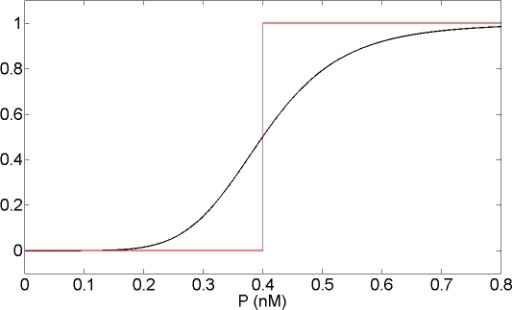

# Designing and training with differentiable lossy sparsifier layer

The time and energy consumption for data movement and computation in DNNs can be minimized further by introducing additional sparsity into the activation maps. This project aims to introduce additional sparsity by implementing lossy sparsification layers which are learned dynamically during training into the neural network. Sum of L0 norm values of different output activation maps of sparsifier layers is introduced into the cost function for learnability.

In this work, we have looked at dynamically learning the soft thresholding for the activation maps.

We have tested our method on follwing networks:
* AlexNet
* Resnet18
* Resnet34
* Densenet121
* MobilenetV2
* Mnasnet1_3

In order to run the code on colab, there is a cell that mounts the drive in colab and creates the folder to store the MlFlow runs

The functions used in the notebook are summarised below below

1. LossySparsifier
``` python
#https://pytorch.org/tutorials/beginner/examples_nn/two_layer_net_module.html

class LossySparsifier(nn.Module):
    """
    Takes an activation map as input and outputs the sparsified map.
    The sparsified map has to be computed using differentiable functions.
    Has a learnable parameter which is used to threshold based on absolute values.
    """
    def __init__(self, eps = None, a = 1.0):
        """
        In the constructor we randomly instantiate the threshold value
        """
        super(LossySparsifier, self).__init__()
        # initialize eps as trainable parameter
        if eps == None:
            self.eps = nn.Parameter(torch.tensor(0.1))
        else:
            self.eps = nn.Parameter(torch.tensor(eps))

        self.eps.requires_grad = True
        self.a = a

    def forward(self, x):
        """
        In the forward function we accept a Tensor of input data and we must return
        a Tensor of output data. We can use Modules defined in the constructor as
        well as arbitrary operators on Tensors.
        """
        e = torch.abs(self.eps)
        y = torch.sigmoid(self.a * (x - e)) * x
        z = torch.sigmoid(self.a * (-e - x)) * x
        return y + z
```

 The LossySparsifier module implements the Lossy Sparsifier layer that will do the soft thresholding of the activation maps.

 For soft thresholding we are trying the function involving sigmoid activation. The approximation looks like the plot displayed below

 

2. SparseLoss
```python
class SparseLoss(nn.Module):
    """
    Custom loss function which has the norm term
    """
    def __init__(self):
        super(SparseLoss,self).__init__()
        
    def forward(self, out, target, list_, memRegParam, lossObj, normPenalty):
        norm_loss = 0.
        sum_ = 0.
        for x in list_:
            norm_loss += memRegParam * normPenalty(x)
            sum_ += np.prod(x.shape)
        return lossObj(out, target) + norm_loss / sum_     

```

This module implements the loss term that reflects the sparsity for the layer. Lesser the sparsity, more the loss.

3.
```python
sparse_layer_outputs = [] # clear this after each pass in training
sparse_layer_params = []

def storeSparseLayerOutput(model, input, output):
    sparse_layer_outputs.append(output)

def storeSparsificationParam(model, input, output):
    sparse_layer_params.append(model._modules['sparse'].eps)

layers_to_be_sparsified = (nn.modules.conv.Conv1d,
                            nn.modules.conv.Conv2d,
                            nn.modules.conv.Conv3d,
                            nn.modules.conv.ConvTranspose1d,
                            nn.modules.conv.ConvTranspose2d,
                            nn.modules.conv.ConvTranspose3d,
                            nn.modules.linear.Linear,
                            nn.modules.linear.Identity,
                            nn.modules.linear.Bilinear)

layers_to_be_recursed = (nn.modules.container.Sequential,
                         torchvision.models.resnet.BasicBlock,
                         torchvision.models.mobilenet.InvertedResidual,
                         torchvision.models.squeezenet.Fire,
                         torchvision.models.mnasnet._InvertedResidual
                         )

def addSparsifierLayers(model, eps_start):
    sparse_layers = OrderedDict()
    for var_name, module in model._modules.items():
        # each module is an OrderedDict
        if(isinstance(module, layers_to_be_sparsified)):
            model._modules[var_name] = nn.Sequential(OrderedDict([('0', module), ('sparse', LossySparsifier(eps_start))]))
            sparse_layers[var_name] = OrderedDict()
        elif(isinstance(module, layers_to_be_recursed)):
            sparse_layers[var_name] = addSparsifierLayers(module, eps_start)
    return sparse_layers

def registerHooks(model, dict_):
    for key, value in dict_.items():
        if(len(value) == 0):
            model._modules[key].register_forward_hook(storeSparseLayerOutput)
            model._modules[key].register_forward_hook(storeSparsificationParam)
        else:
            registerHooks(model._modules[key], value)
     
def sparsify(model, eps_start):
    sparse_layers = addSparsifierLayers(model, eps_start)
    registerHooks(model, sparse_layers)
    return sparse_layers

```
The module implements the automatic sparsification of the network. Currently ResNet18/34, AlexNet, Densenet121, Mnasnet1_2, Mobilenetv_2, Squeezenet can be sparsified with this method. To sparsify the model of your choice, just add the network specific block in the ```layers_to_be_recursed``` tuple.

4. 
```python
def L1_penalty(x):
    return torch.norm(x, p = 1)

def L2_penalty(x):
    return torch.norm(x, p = 2)

def L0_penalty(x):
    return torch.sum(x**2 / (x**2 + b))

def normalized_L1_penalty(x):
    return torch.norm(x, p = 1) / np.prod(x.shape)

def normalized_L2_penalty(x):
    return torch.norm(x, p = 2) / np.prod(x.shape)

def normalized_L0_penalty(x):
    return torch.sum(x**2 / (x**2 + b)) / np.prod(x.shape)
```

Various penalty measures for sparsity loss.

5. Updating the sigmoid parameter
```python
def updateSigmoidParam(model, dict_):
    for key, value in dict_.items():
        if(len(value) == 0):
            model._modules[key]._modules['sparse'].a *= 2.
        else:
            updateSigmoidParam(model._modules[key], value)
```

This function updates the sigmoid multiplication parameter for sparsifier layer. This would be used to schedule the parameter in training.

6. Hard Sparsification
```python
def addHardSparsifierLayers(model, dict_):
    for key, value in dict_.items():
        if(len(value) == 0):
            e = model._modules[key]._modules['sparse'].eps
            model._modules[key]._modules['sparse'] = LossyHardSparsifier(e)
        else:
            addHardSparsifierLayers(model._modules[key], value)
     
def hardSparsify(model, sparse_layers):
    addHardSparsifierLayers(model, sparse_layers)
```

```python
class LossyHardSparsifier(nn.Module):
    """
    Takes an activation map as input and outputs the sparsified map.
    The sparsified map has to be computed using differentiable functions.
    Has a learnable parameter which is used to threshold based on absolute values.
    """
    def __init__(self, eps = None):
        """
        In the constructor we randomly instantiate the threshold value
        """
        super(LossyHardSparsifier, self).__init__()
        # initialize eps as trainable parameter
        if eps == None:
            self.eps = nn.Parameter(torch.tensor(0.1))
        else:
            self.eps = nn.Parameter(torch.tensor(eps))
            
        self.eps.requires_grad = True

    def forward(self, x):
        """
        In the forward function we accept a Tensor of input data and we must return
        a Tensor of output data. We can use Modules defined in the constructor as
        well as arbitrary operators on Tensors.
        """
        x[torch.abs(x) <= torch.abs(self.eps)] = 0.
        return x
```

Post training with soft thresholding, hard thresholding will be implemented that makes the values less than the learned thresold to 0.

